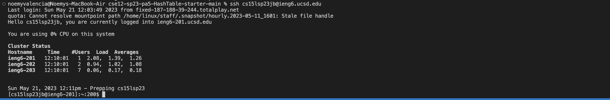
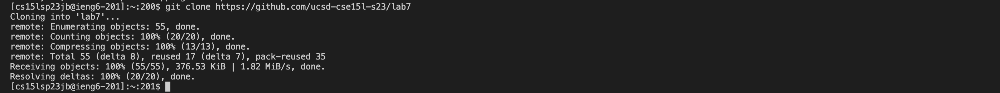
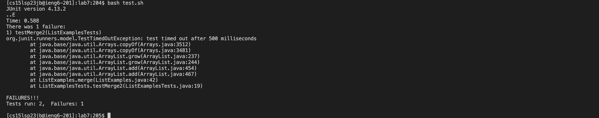
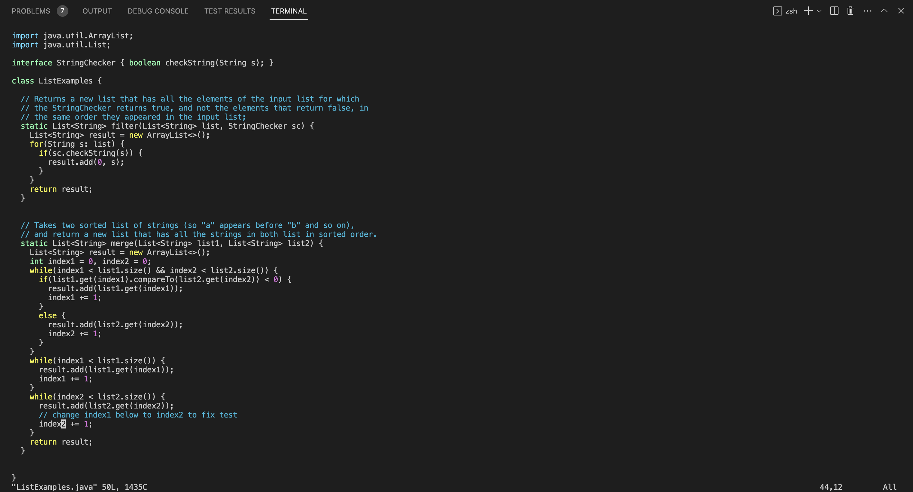
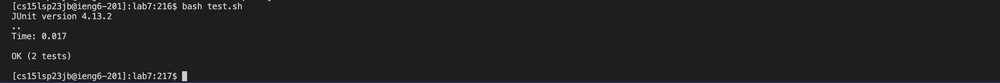
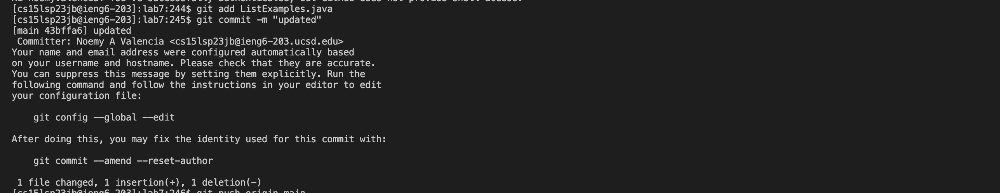

# Lab Report 4 
---

To edit and fix the failing tests in lab7. I followed these next steps.

## Step 1: Log in to my CSE 15L account: 
1. Open Visual Studio Code.
2. Open new terminal in bash.
3. Log in to my account by typing `ssh cs15lsp23jb@ieng6.ucsd.edu`

---

## Step 2: Clone fork of repository: 
1. Type `git clone https://github.com/ucsd-cse15l-s23/lab7` into terminal.

---

## Step 3: Run failing tests: 
1. Type `cd lab7` into terminal.
2. Type `bash test.sh` into terminal to see output from the tests.

---

## Step 4: Edit code: 
1. Type `vim ListExamples.java` into terminal to edit the code.
3. Type `/index1` and press <enter>.
4. Press `<n>` 9 times until I get to the last index1.
5. Press `<l>` 5 times until cursor is on top of 1.
6. Type `<x>`.
7. Type letter `<i>` and type 2. 
8. Press `<esc>`.
9. Type `:wq` and press `<enter>`.

---

## Step 5: Run tests again: 
1. Press `<up><up><enter>` to run tests again.

---

## Step 6: commit and push changes: 
1. Type `git add ListExamples.java`.
2. Type `git commit -m "updaded"`.
3. Type `git push origin main`.

---

And with that, I've made sure that my tests are running and my changes are saved.
